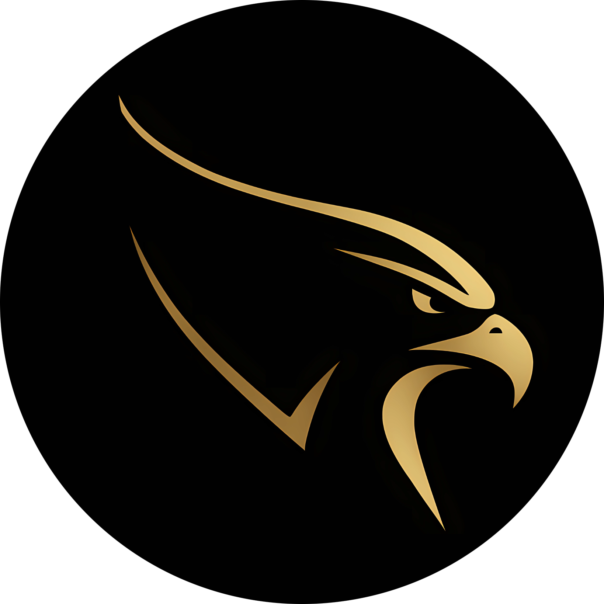

## 🌐 Horus AutoPilot - DJI Tello

**Horus AutoPilot** is a project focused on creating a fully autonomous drone using the **DJI Tello**. The drone will be capable of autonomous flight and landing, with features like face and object tracking.

## ⚠️ Disclaimer

This project is currently under development and should **not** be used for real flights.  
Some features are not yet implemented, and bugs may still occur.

## ⭐️ Features

- [x] Face tracking
- [ ] Object tracking
- [ ] Autonomous flight

## 📕 Documentation

The documentation is currently in progress and will be available soon.

## 🤓 Contact

If you want to get in touch, you can reach me through:

- [LinkedIn](https://www.linkedin.com/in/diego-dg/)
- [Instagram](https://www.instagram.com/diegodg_01/)

## 🤝 Contributing

Contributions, issues, and feature requests are welcome!  
Feel free to check the [issues page](https://github.com/DiegoDG-01/Horus-AutoPilot/issues).

## 📄 License

This project is licensed under the MIT License. See the [LICENSE](LICENSE) file for more details. 